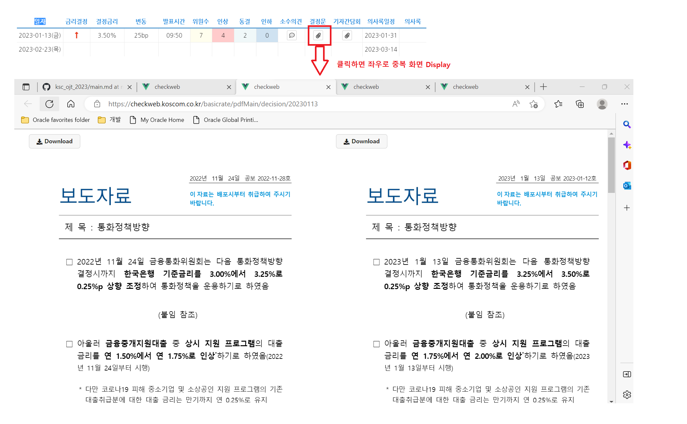
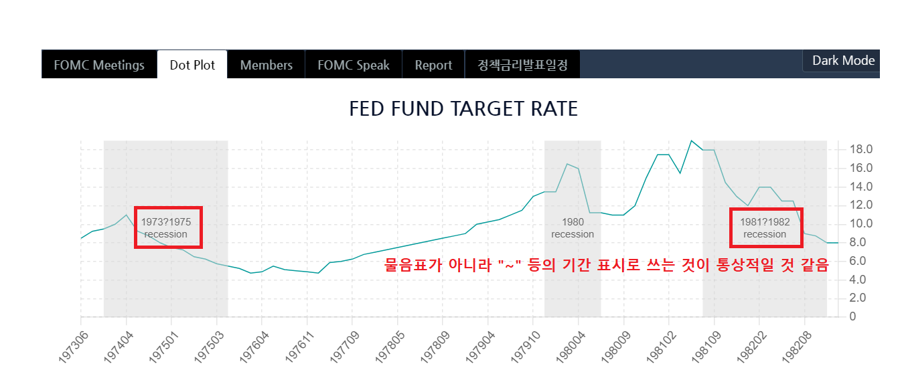
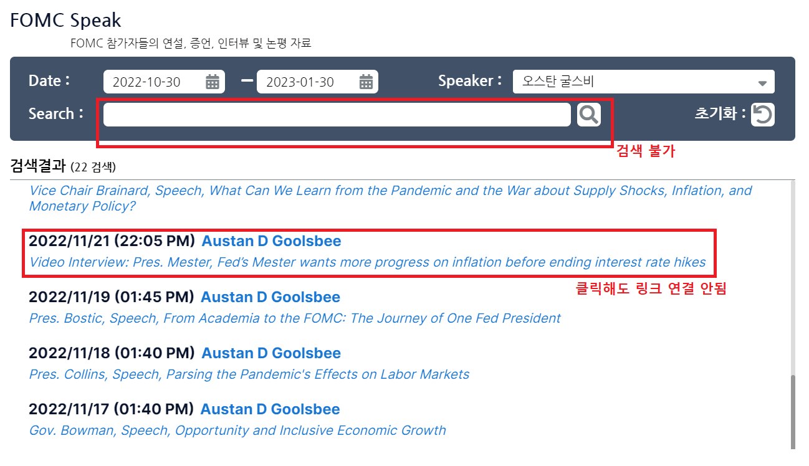

[QA] CHECKWEB 오류 및 개선사항 공유(OJT_230130)
--

안녕하십니까, 안지원 과장님.
2022년 하반기 신입사원 백민주입니다.

금일(1.30.월) 수행 중인 OJT 관련하여,
다음과 같이 CHECKWEB의 3건의 오류와 1건의 개선점을 공유드립니다.

◎ CHECKWEB 오류(3건)

1. (금통위) 결정문 클릭 시 중복화면 노출

2. (FOMC) Dot Plot 기간 표시 시 "?" 기호 노출

3. (FOMC) FOMC Speak 검색 불가 및 링크 연결 불가

◎ CHECKWEB 개선 요청(1건)

1. CHECKWEB 통합 화면 필요
    - CHECKWEB 종류 3가지(금통위, FOMC, 경제지표)를 한번에 볼 수 있으면 사용성이 높아질 것이라고 생각합니다.
  
감사합니다.

#### 백민주 드림
