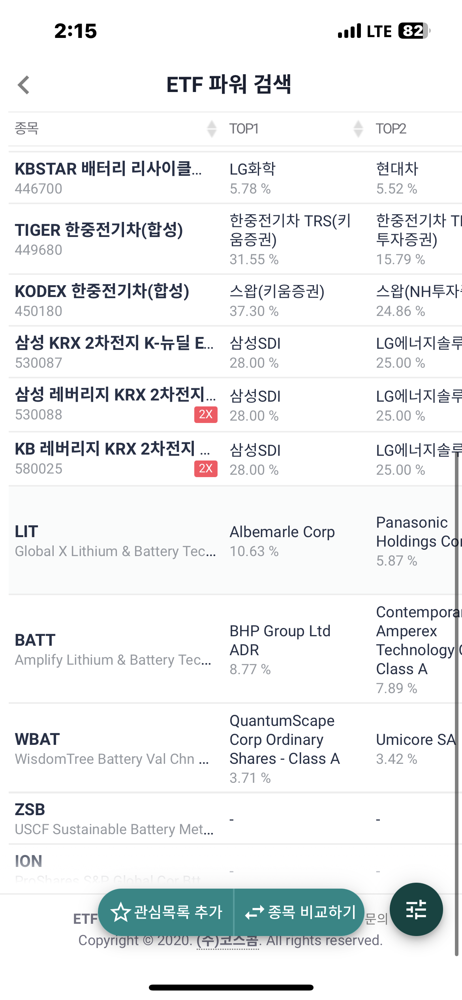

#과제2 ETF화면 관련

## 개선방안

###공통

- 그래프 확대기능 제공
- 화면을 오른쪽 모션시 내용이 없을시 화면이 튕겨나오게
- 
### ETF_CHECK

- 실시간 시세 제공

## 오류내용

### ETF_CHECK

 - ETF파워검색시, 국내상장ETF 맨마지막 종목 종목잘림 버그 {:width="100px" height="100px"} 
