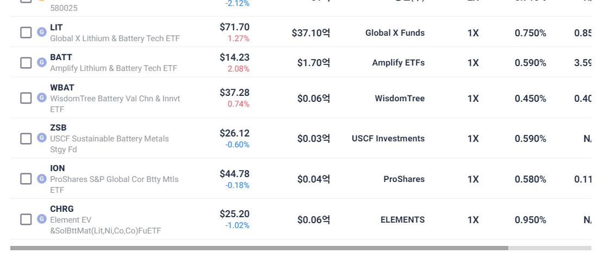
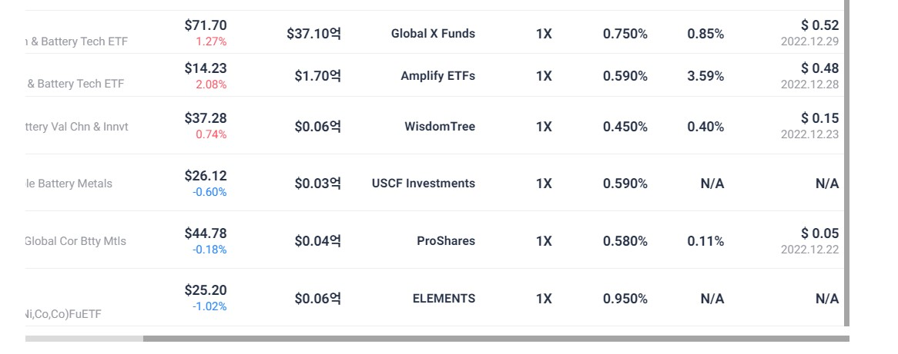

[ETF CHECK] 버그 및 개선 건의사항 등

1. 버그
웹화면 - 홈 - US HOT 테마

하단 회색 스크롤을 움직여 다른 순위를 보려고 할 때,
이동이 이 원활하게 움직이지 않습니다.

(1) 1~8위까지만 보이거나, 
(2) 이전으로 돌아가지 않는 경우가 있습니다.

2. 개선 건의사항
(1) ETF 파워검색 관련
웹화면 - 분석스튜디오 - ETF 파워검색

검색화면에서 가로 스크롤을 가장 오른쪽으로 옮겼을 때만 세로 스크롤을 움직일 수 있습니다.
가로 스크롤 움직임 없이 세로 스크롤을 옮길 수 있으면 좋을 것 같습니다.

(2) 기타
전반적으로 글씨크기가 조금 더 커지면
가독성이 좋아질 것 같습니다. 
