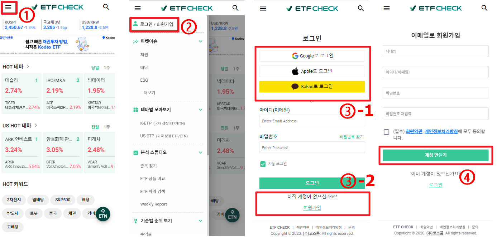
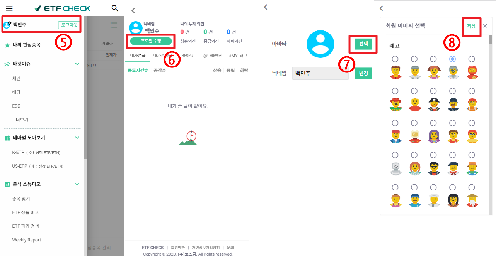

# [과제3] ETF CHECK 가입 및 프로필 변경 매뉴얼

> Author: 2022 하반기 신입사원 백민주
> 
> Created: 2023-01-30
> 
> Device : **Samsung Galaxy S8+**
***

### ➡️ Step1. ETF CHECK 가입

 - 1. 상단 좌측의 아이콘을 클릭한다.
 - 2. `로그인/회원가입` 버튼을 클릭한다.
 - 3. 회원가입을 진행한다.
   > - ① 소셜 아이디가 있으면 소셜 아이디로 가입한다. (Google/Apple/Kakao)
   > - ② 소셜 아이디가 없으면 하단의 회원가입 버튼을 클릭한다.
 - 4. 회원가입 정보 입력 후 `계정 만들기` 버튼을 클릭한다.

### ➡️ Step2. 프로필 이미지 변경

 - 5. 상단 좌측의 로그인 된 `내 이름`을 클릭한다.
 - 6. `프로필 수정` 버튼을 클릭한다.
 - 7. 아바타의 `선택` 버튼을 클릭한다
 - 8. 원하는 **레고 이미지**를 선택한 이후 `저장`버튼을 클릭한다.
