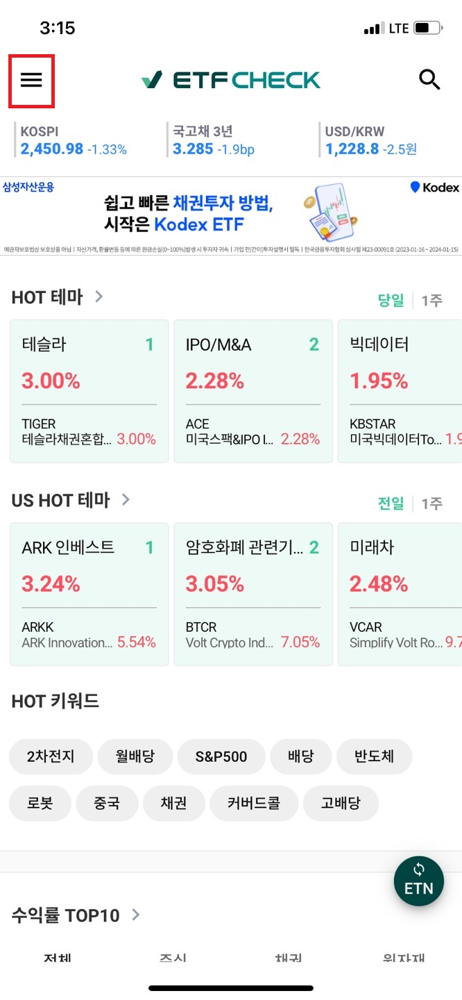
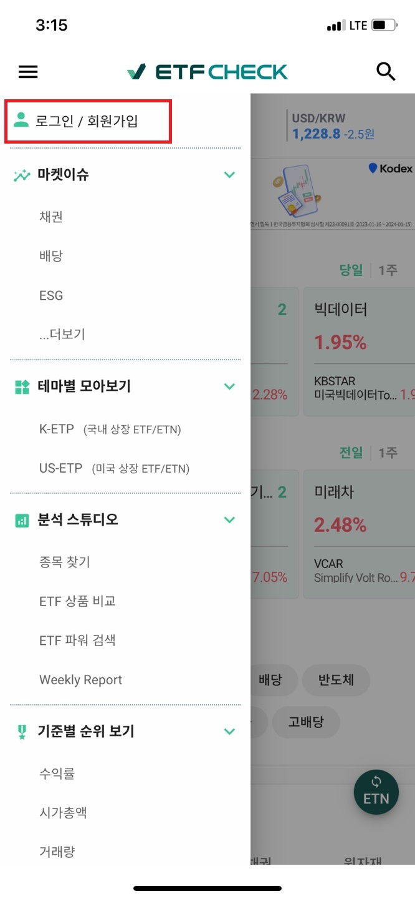
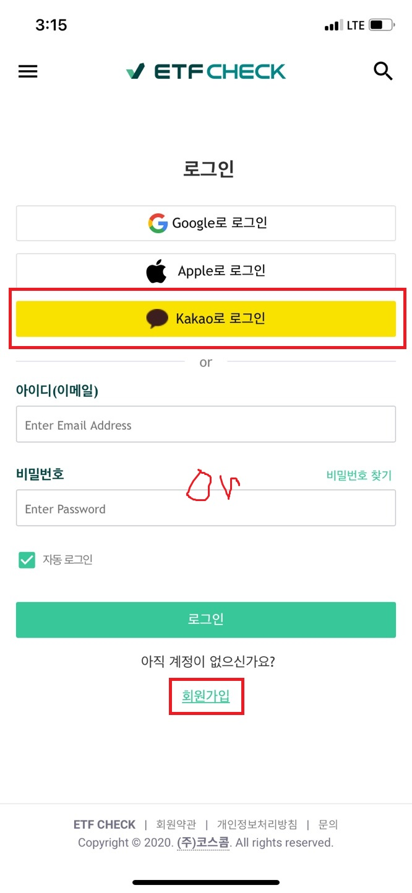
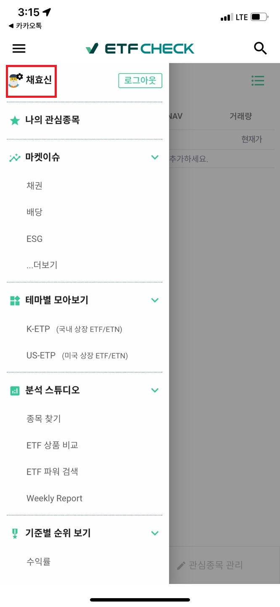
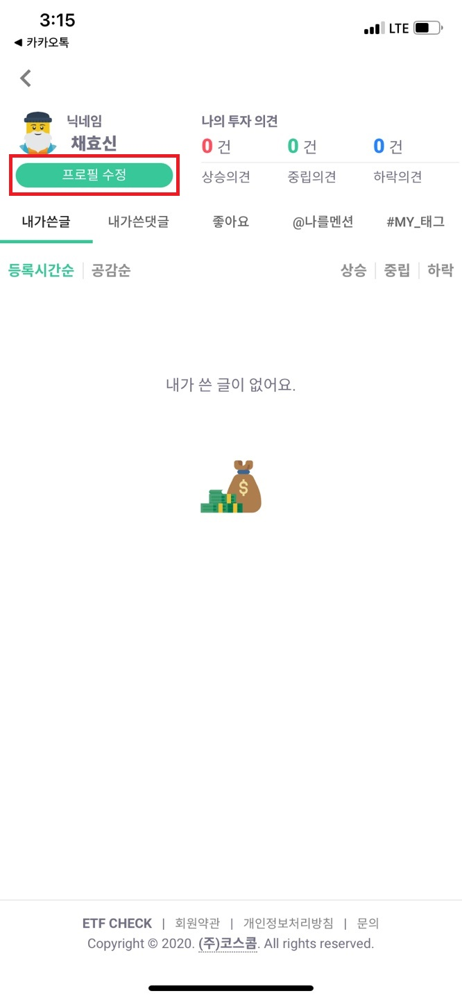
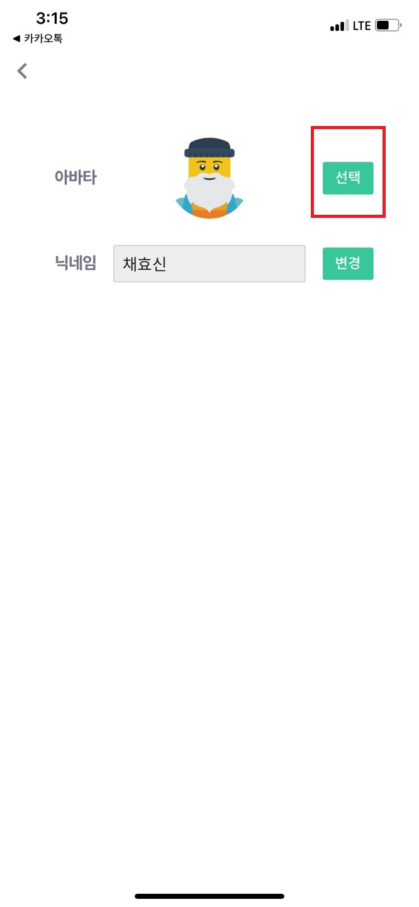
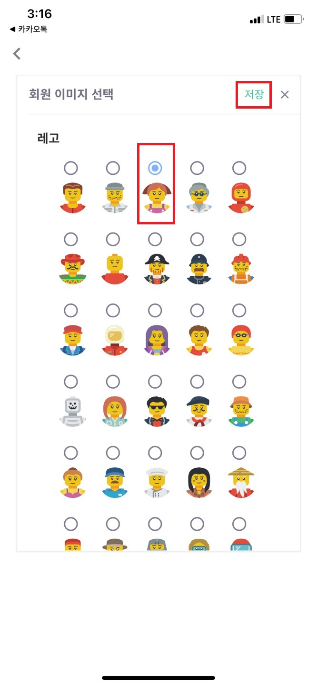
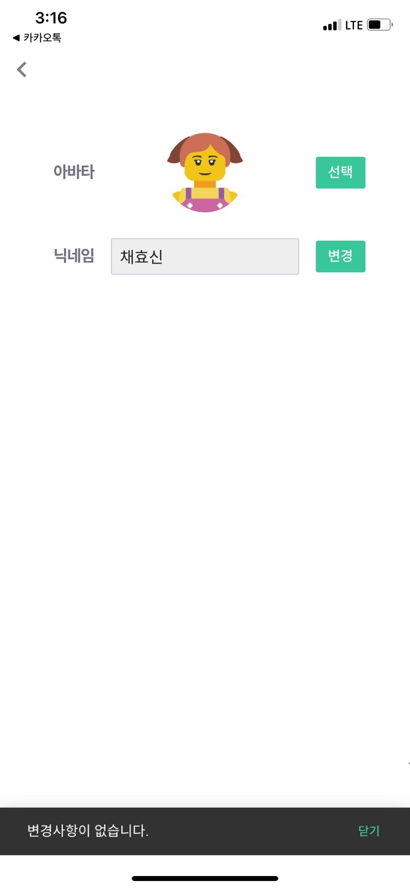

### **ETF CHECK 회원가입 및 프로필 수정 방법(모바일)**
 
 
  
  ## **1. 회원가입 및 로그인**
   
   
  (1)상단 왼쪽 줄3개 클릭  
  
  
  
   
  (2)로그인/회원가입 클릭
  
  
  
   
  (3)카카오톡 아이디 있는 경우 카카오톡 클릭
    없는 경우 아래 회원가입 클릭하여 정보입력
  
  
  
   
  (4)로그인 완료
  
  
  
   
   
   
  ## **2. 프로필 변경하기**
   
   
  (1)로그인 후 상단 왼쪽 이름 클릭 
  
  
  
   
  
  (2)프로필 수정 클릭 
  
  
  
   
  
  (3)선택(아이콘 변경) 또는 변경(닉네임 변경)클릭 
  
  
  
   
  
  (4)원하는 아이콘 클릭 후 저장 클릭
  
  
  
   
  
  (5)변경 완료 
  
  
  
   
