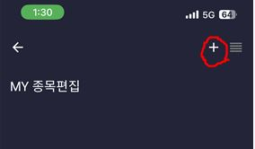
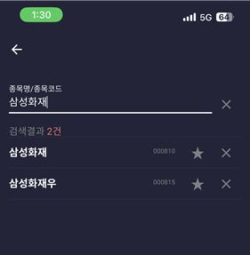
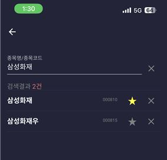
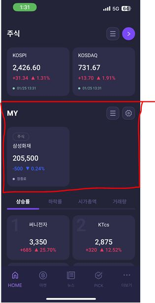

> ## CHECK m+에서 MY 에 관심종목 등록 방법

**0. 회원가입을 진행합니다.**

**1. 회원가입 직후 아래와 같은 초기 상태가 보이면 MY 오른쪽 상단의 메뉴바를 클릭합니다.**

**==> 관심종목으로 아무것도 설정하지 않은 초기화면**

**2. 아래 화면의 + 을 클릭합니다.**

**3. 본인이 관심있는 종목을 검색합니다.**

ex. 관심종목이 '삼성화재'일 경우

**4. 관심종목으로 등록하려면 해당 종목의 별표를 클릭합니다.**

**==> 별표가 노랑색으로 바뀌는 걸 확인할 수 있습니다.**

**5. HOME으로 들어오면 '삼성 화재'가 MY의 관심종목에 등록돼 있는 것을 확인할 수 있습니다.**

# :+1: :+1: :+1: :+1: :sparkles:수고하셨습니다!! :+1: :+1: :+1: :+1:
