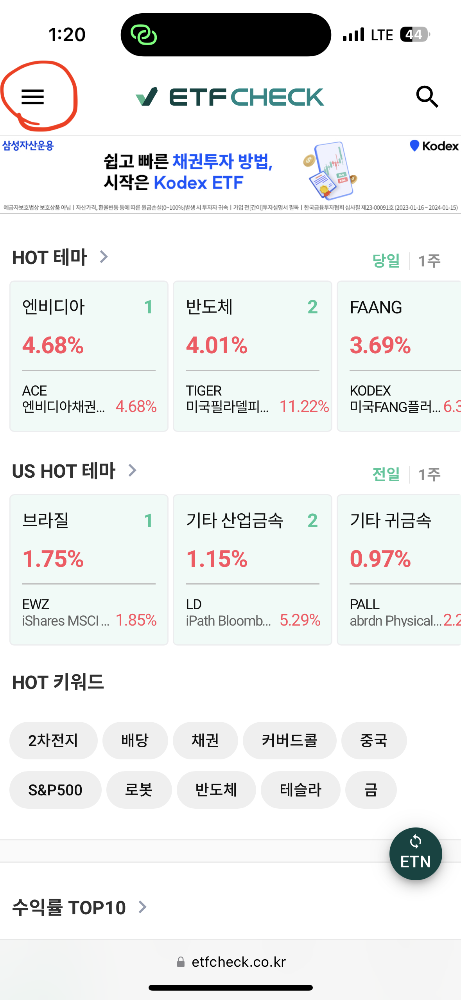
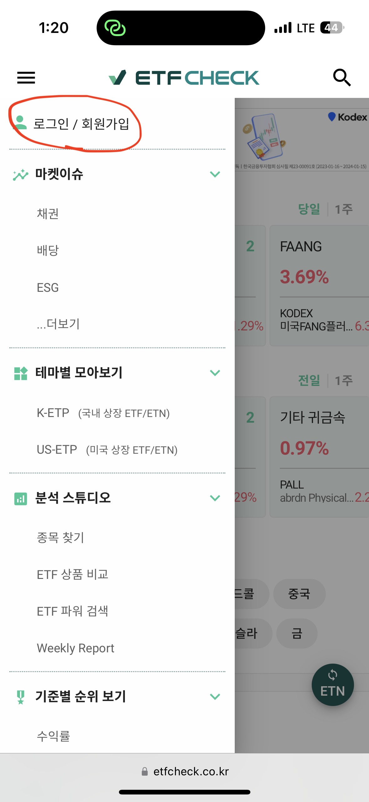
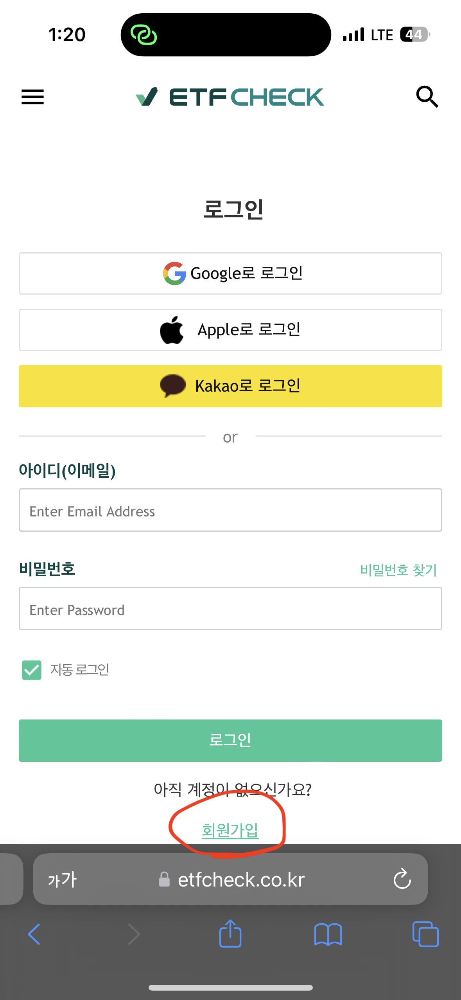
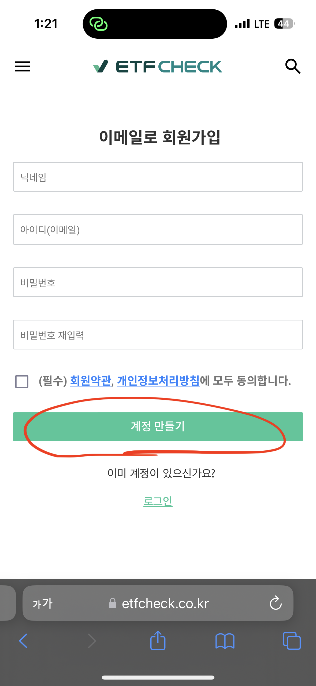
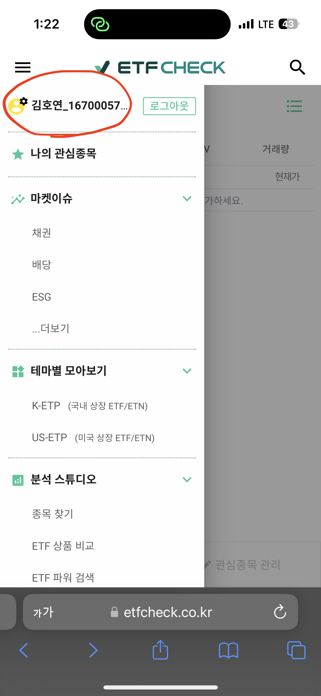
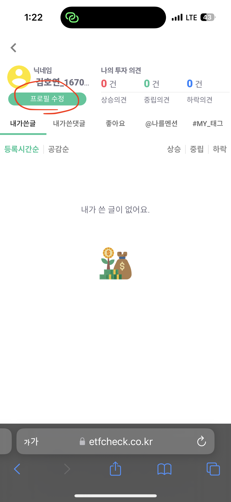
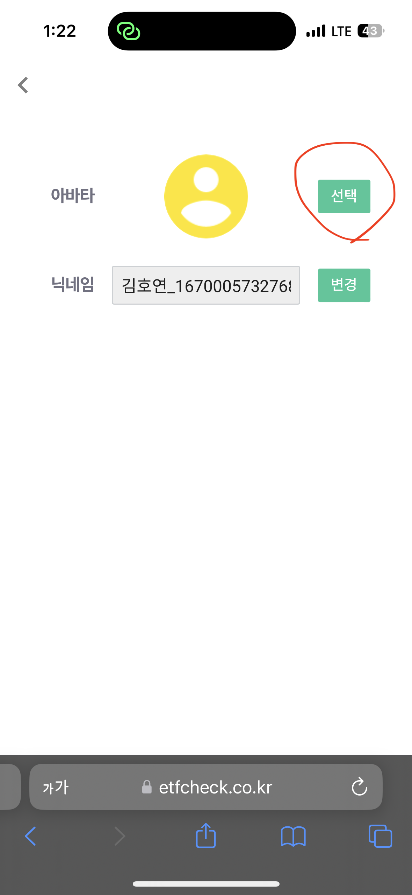
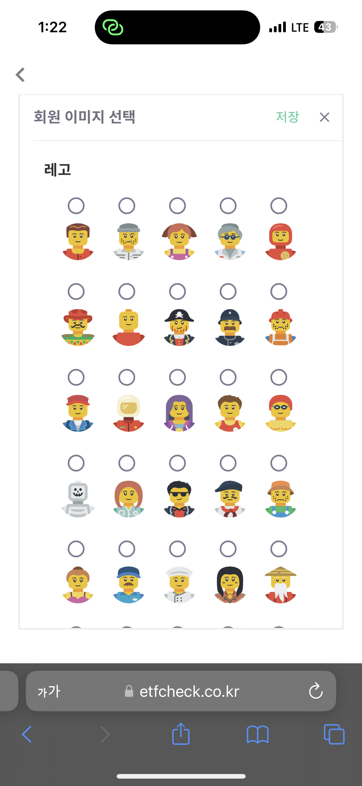
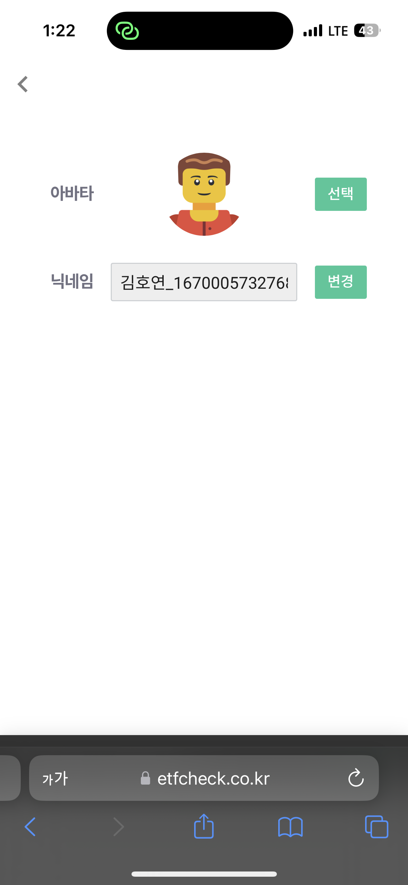

### ETF CHECK에 가입해서 프로필 사진 바꾸기
---

#### 1. ETF CHECK에 접속하여 빨간 부분을 클릭한다.

#### 2. 로그인/회원가입을 클릭한다.

#### 3. 회원가입을 클릭한다.

#### 4. 계정만들기를 클릭한다.

#### 5. 가입후 로그인을 하여 자신의 프로필을 확인한다.

#### 6. 프로필 수정을 위해 프로필 수정 버튼을 클릭한다.

#### 7. 선택 버튼을 클릭한다.

#### 8. 원하는 프로필 사진을 정한다.

#### 9. 지정한 프로필로 변경되었는 지 확인한다.

